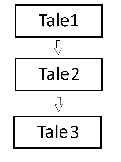

# RPGのTaleシステムの仕組み

## Taleシステム
taleはrpgゲームを物語として構成するための仕組みです。   
   
進行しているtaleが完了すると次のtaleに移動します。   
完了しない場合、taleが継続されます。    
taleはtaleを含めることができ、親子関係にできます。   
## Puppet
パペットは、現状固定のスプライトを持つことができます。
将来的にスプライトアニメを再生したり、エフェクトを表示できます。
## 特徴
フラグ管理などがTale内で完結するため、ほかのクラスとの責任の問題や、競合問題、重複を引き起こしにくいです。