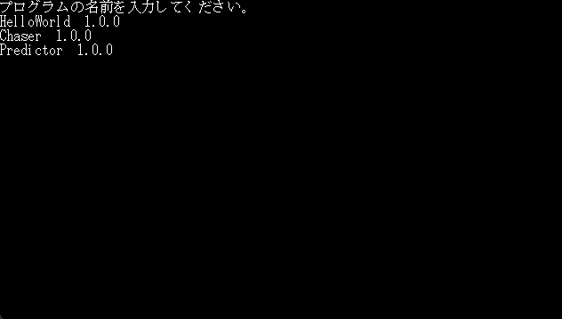

# ゲームの作り方
簡単に使えるのでぜひゲーム開発してみてください。   
```cs
using Microsoft.Xna.Framework;
using MyGame002.MonoECS;
using System;
using System.Collections.Generic;
using System.Linq;
using Component = MyGame002.MonoECS.Component;

namespace MyGame002.GameProgram.Game.G0
{
    public class Game000 : GameBase
    {
        Entity entity = new Entity();
        public void Dispose()
        {
            
        }

        public void Draw(GameTime gameTime)
        {
            
        }

        public List<Component> GetComponents()
        {
            List<Entity> entities = new Entity[] { entity }.ToList();
            return EntityUtil.GetAllComponentsFromEntity(entities.ToArray());
        }

        public void Initialize()
        {
            
        }

        public void Start()
        {
            
        }

        public void Update(GameTime gameTime)
        {
            
        }
    }
}
```
InitializeはMonoGameの仕様に合わせてあるため、MonoGame自体が初期化された後、呼ばれませんのでここにコードを書いてもほとんど呼ばれません。
このインターフェースですが、Startは少し危ない挙動をします。      
Startが実行してないのにUpdateとDraw関数が先に呼び出されることがよくあります。   
MonoGame側のループを犠牲にしないための仕方がない部分です。
```cs
public void Draw(GameTime gameTime)
{
	if (!initialized)
	{
		return;
	}
}

public void Update(GameTime gameTime)
{
	if(!initialized)
	{
		return;
	}
}

public void Start()
{
	initialized = true;
}
```
このような処理を追加してください。


```cs
public void Start()
{
	entity.AddComponent(new TextRender(entity, 1, "Hello World", Color.White));

	initialized = true;
}
```
entityにコンポーネントを追加する例です。
```cs
public TextRender(Entity entity,float size,string text,Microsoft.Xna.Framework.Color color)
```
です。   

ゲームのプログラムを追加します。
Program.csに、
```cs
MyGame002.Game1.GetInstance().GetProgramManager().AddProgram(new GameProgramInfo("HelloWorld", "1.0.0", new Game000()));
```
を追加します。※日本語入力と記号に対応していないので英数字にしてください。
   
HelloWorldと入力した後ゲームを実行するとゲームが起動します。
   

# コンポーネント
```cs
using Microsoft.Xna.Framework;

namespace MyGame002.MonoECS.Components.G0
{
    public class ExampleComponent : Component
    {
        Entity entity;
        public ExampleComponent(Entity entity)
        {
            this.entity = entity;
        }
        public void Draw(GameTime time)
        {
            
        }

        public void Start()
        {
            
        }

        public void Update(GameTime time)
        {
            
        }
    }
}
```
このコードからコンポーネントを作れます。
今回は、entityの位置を変更してみます。

```cs
public void Update(GameTime time)
{
    entity.SetPosition(new Vector2((float)time.TotalGameTime.TotalSeconds*2, (float)time.TotalGameTime.TotalSeconds * 2));
}
```
とすれば、秒ごとにentityが動きます。

```cs
public void Start()
{
	entity.AddComponent(new TextRender(entity, 1, "Hello World", Color.White));
    entity.AddComponent(new ExampleComponent(entity));

	initialized = true;
}
```
でエンティティを追加してみてください。   
   
移動しました。